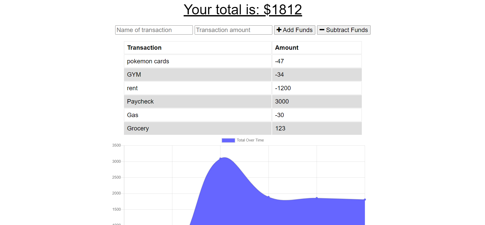

# Offline Budget Tracker
A user is able to add expenses and deposits to their budget with or without an internet connection. When entering transactions offline, they populate the total when brought back online.

[Link to Github Repo](https://github.com/AlexWilsonNC/offline-budget-tracker)

[Link to Heroku Deployed Site](https://alex-offline-budget-tracker.herokuapp.com/)

